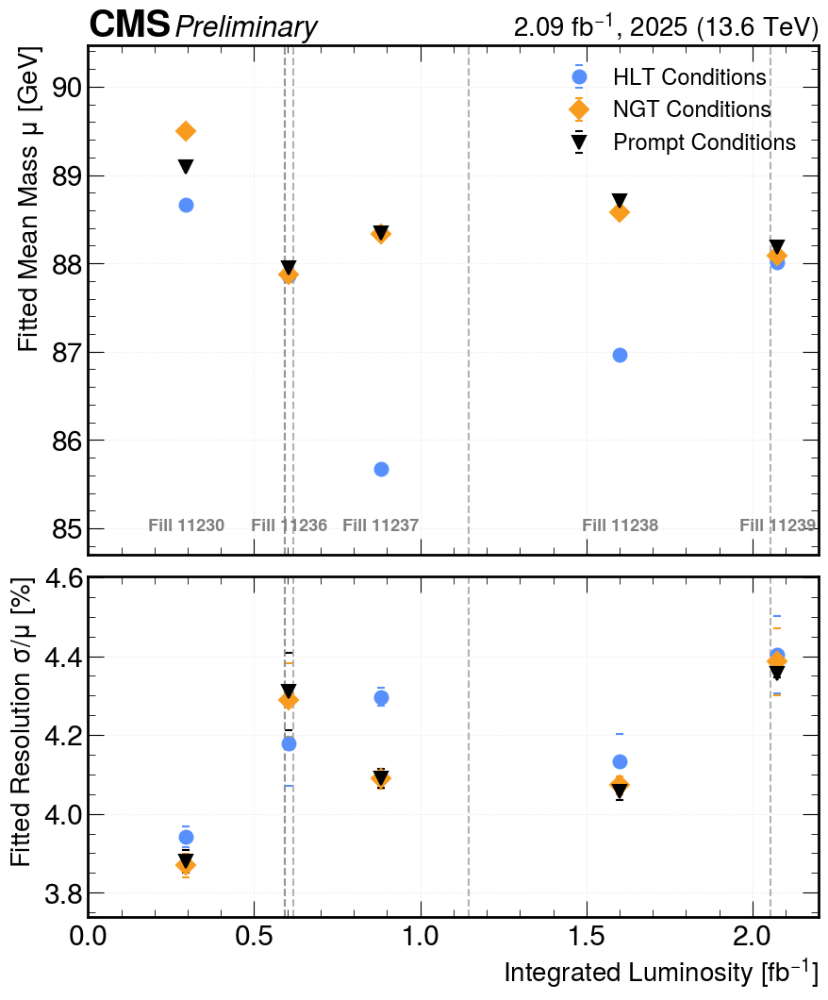

# HLT Electron 
## Dataset

## Requirements
As a first step, please follow requirements as indicated (here)[https://github.com/jprendi/sakura/tree/main/ApprovedPlots/CMS-DP-2026/028/EGamma/FinalPlots/HLTScoutingEGamma#requirements].
Now, since here we run into issues with the regularly used python3 version, we will be running specifically in Python 3.13. I don't remember what the issue was anymore, but it was related to ROOT. :)
What is also needed is the lumi data, obtained in a CMSSW environment with this command:
```
brilcalc lumi --begin 398675 --end 398858 -u /pb --output-style csv > lumi_data.csv
```

## Plots and scripts

| Plot | Python Script |
| :--- | :--- |
|  | `python3.13 Z_to_ee_fit.py` |
|  | `python3.13 Z_to_ee_fit_stability_per_fill.py` |
