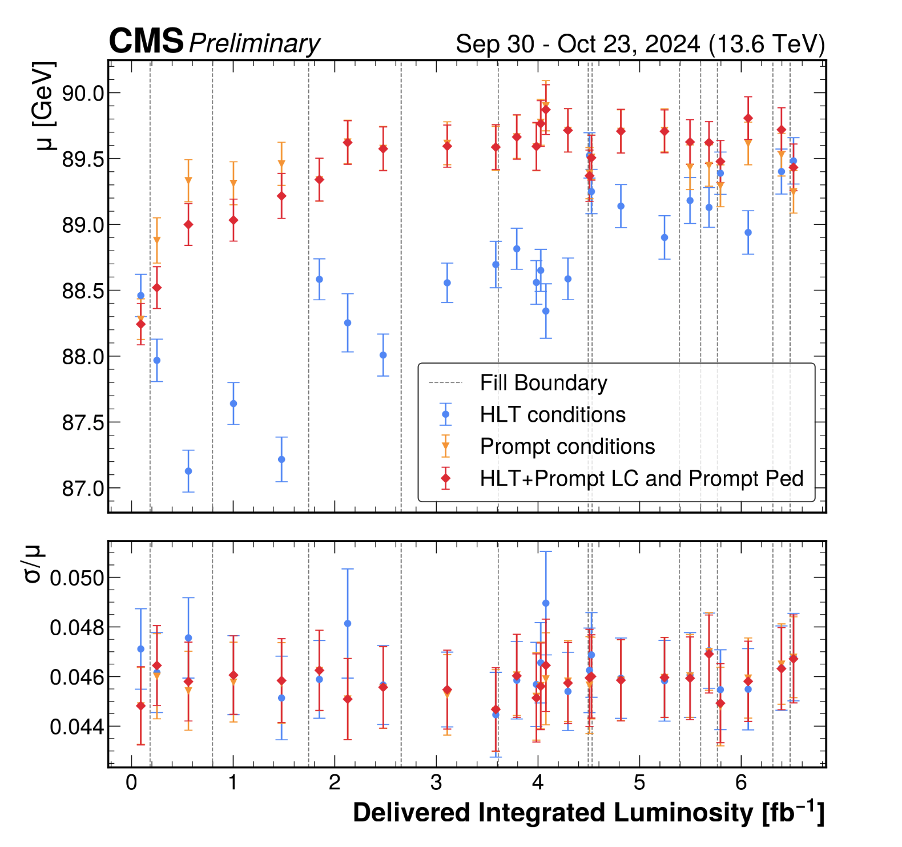
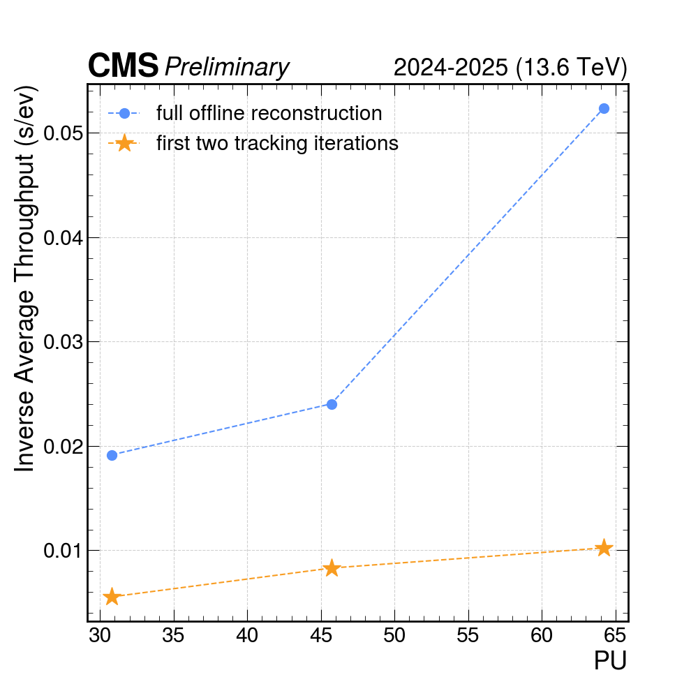
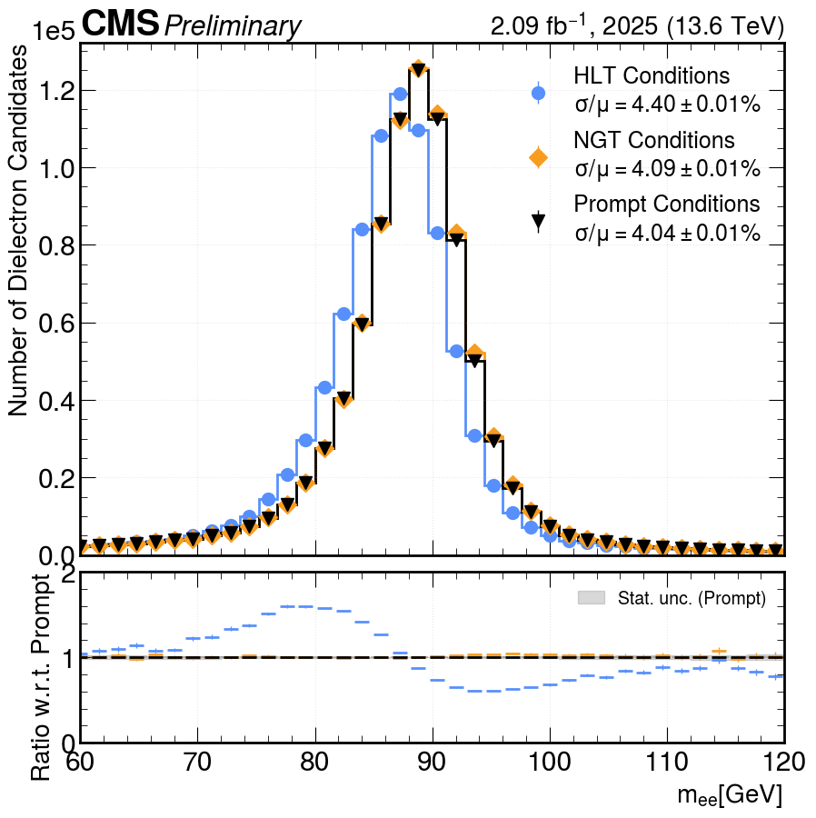

# CMS Detector Performance Summaries by the `sakura` team
## Overivew
This directory should include an overview of all the DP notes and recipes on how the approved plots were obtained.

Here a list of our DPS notes:
- [CMS-DP-2025/082](https://cds.cern.ch/record/2950076)
- [CMS-DP-2025/087](https://cds.cern.ch/record/2951246)
- [CMS-DP-2026/028](https://cds.cern.ch/record/2961610)

## Summaries of DPS notes

### [CMS-DP-2025/082](./CMS-DP-2025/082) 
<table width="100%">
  <tbody>
    <tr>
      <td width="50%" valign="top">
        <strong>Title:</strong> Next Generation Triggers Demonstrator: Time Variation of the Calibrations and System Monitoring  
        <strong>Abstract:</strong> This note presents an overview of the Next Generation Triggers (NGT) Demonstrator in CMS. It summarizes studies of the effect of different calibrations on physics observables and their time-dependence. It also outlines the live monitoring setup, showing that NGT-derived calibrations are correctly produced, integrated, and used for online reconstruction.  
        Relevant links: <a href="https://cds.cern.ch/record/2950076">CDS</a>, <a href="https://twiki.cern.ch/twiki/bin/view/CMSPublic/DP2025082">twiki</a>
      </td>
      <td width="50%" valign="top" align="center">
        
      </td>
    </tr>
  </tbody>
</table>

### [CMS-DP-2025/087](./CMS-DP-2025/087)
<table width="100%">
  <tbody>
    <tr>
      <td width="50%" valign="top">
        <strong>Title:</strong> Profiling the CMS reconstruction options within the Calibration Loop  
        <strong>Abstract:</strong> This notes presents profiling results of the CMS Prompt Calibration Loop, aiming at delivering detector conditions within 48h of data taking to promptly reconstruct the CMS data using Tier0 resources. We present the performance of an alternative reconstruction configuration, with reduced tracking iterations, in order to deliver a subset of calibration constants within an 8h target and limited computing power.  
        Relevant links: <a href="https://cds.cern.ch/record/2951246">CDS</a>, <a href="https://twiki.cern.ch/twiki/bin/view/CMSPublic/DPNoteProfilingPromptCalibrationLoop">twiki</a>
      </td>
      <td width="50%" valign="top" align="center">
        
      </td>
    </tr>
  </tbody>
</table>

### [CMS-DP-2026/028](./CMS-DP-2026/028)
<table width="100%">
  <tbody>
    <tr>
      <td width="50%" valign="top">
        <strong>Title:</strong> Physics Performance assessment of the Run 3 Optimal Calibrations Next Generation Triggers Demonstrator  
        <strong>Abstract:</strong> This note presents an assessment of the physics performance of the High-Level Trigger (HLT) reconstruction, in which buffered data are reprocessed by the Next Generation Triggers (NGT) Run-3 Optimal Calibration demonstrator using updated detector calibrations. The results showcase that the optimal calibration architecture yields significant improvements in physics performance, especially for e/γ objects. This is achieved by increasing the upload frequency of calibrations, specifically the Electromagnetic Calorimeter (ECAL) pedestals and ECAL crystal transparency laser corrections. We deployed a novel calibration loop prototype developed in late 2025. Within this prototype, we successfully derived ECAL pedestals with prompt-like quality across several runs, integrated the ECAL crystal transparency laser corrections in time, and derived a bad component mask of the Silicon Strip Tracker for a single run. The analysed data correspond to the last days of the 2025 proton-proton data-taking period (October 29 to November 4), comprising an integrated luminosity of 2.09 fb⁻¹ at √s = 13.6 TeV.  
        Relevant links: <a href="https://cds.cern.ch/record/2961610">CDS</a>, <a href="https://twiki.cern.ch/twiki/bin/view/CMSPublic/DP2026028">twiki</a>
      </td>
      <td width="50%" valign="top" align="center">
        
      </td>
    </tr>
  </tbody>
</table>
